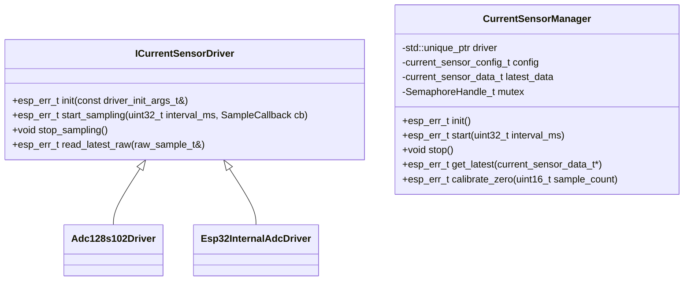

# 版本007 - 电流传感器抽象设计

## 1. 设计目标
1. 使用C++封装电流采集逻辑，提供统一的接口供C代码调用。
2. 抽象层可在编译期选择任意数量的传感器通道（总电流 + 0~6个支路）。
3. 将“外置ADC128S102 (SPI)”与“ESP32S3内置ADC”实现拆分为两个派生类，满足策略模式。
4. 保留原有采样、缓存、校准、BLE通知等流程，迁移到新的抽象层。

## 2. 编译期配置
- 在`hardware_defs.h`中新增/沿用常量：
  - `CURRENT_SENSOR_TOTAL_PRESENT` (bool)
  - `CURRENT_SENSOR_CHANNEL_COUNT` (0~6)
  - `CURRENT_SENSOR_CHANNEL_MAP[6]`：索引=逻辑通道，值=ADC物理通道。
  - `CURRENT_SENSOR_DRIVER`：枚举或宏，指明使用外置/内置ADC实现。
- C++层在`current_sensor_config_t`结构中引用上述宏，构造时完成通道过滤，运行期无需再判断硬件差异。

## 3. 核心类结构


### 3.1 ICurrentSensorDriver
- 纯虚接口，仅处理“如何获取ADC原始值”。
- `driver_init_args_t`包含SPI句柄参数或ADC通道列表。
- `SampleCallback`在后台采样任务获得一批原始值时触发，由`CurrentSensorManager`注册。

### 3.2 Adc128s102Driver
- 迁移现有`adc128s102.c`中的SPI初始化、连续采样、批量解析逻辑。
- 负责：
  - SPI总线/设备创建与销毁。
  - 16字节连续读，流水线对齐与原始数组输出。
  - 将中断/任务回调中的原始值放入`raw_sample_t`。

### 3.3 Esp32InternalAdcDriver
- 移植现有内置ADC读取（当前散落在ULP/电压监测部分）中与电流有关的实现；若暂无现成代码，则实现基于`adc_oneshot`的多通道读取模板。
- 配置字段：`adc_unit_t`、`adc_channel_t[]`、采样平均次数等。
- 结果通过回调统一交给上层。

### 3.4 CurrentSensorManager
- 负责：
  - 依据`CURRENT_SENSOR_DRIVER`实例化对应驱动。
  - 将原始ADC值转换为实际电流（参考`adc_calibration_t`参数）。
  - 管理FreeRTOS任务：驱动在后台定时推送原始数据，管理器负责滤波/校准/缓存。
  - 提供线程安全的`get_latest`接口给C层。
  - 封装BLE通知/系统监控所需的事件（如有需要可进一步拆为Observer）。

## 4. 数据结构
```c
typedef struct {
    float total_input_current;         // -1表示无该传感器
    float channel_currents[6];         // 未配置或故障填-1
    uint32_t timestamp_ms;
    uint32_t valid_mask;               // bit0=total, bit1-6=CH1-CH6
} current_sensor_data_t;

typedef struct {
    bool total_present;
    uint8_t channel_count;
    uint8_t channel_map[6];
    float total_sensitivity;   // mV/A
    float total_offset;        // V
    float channel_sensitivity;
    float channel_offset;
} current_sensor_config_t;
```
- `valid_mask`辅助上层判断是否可以触发保护逻辑。
- `CurrentSensorManager`内部还存储`adc_calibration_t`，提供校准接口更新该结构。

## 5. 流程
1. **初始化**
   - `current_sensor_manager_init()`（C桥接函数）在`main.c`中被调用，内部new `CurrentSensorManager`并调用`init()`。
   - 初始化阶段依据宏设置`config`，并构造对应的`ICurrentSensorDriver`。
2. **启动采样**
   - `current_sensor_manager_start(interval_ms)`启动后台任务。
   - 驱动每次采集完所有需要的ADC通道后，通过回调传递`raw_sample_t`。
3. **数据处理**
   - 管理器根据通道类型（总电流/支路）调用`convert_raw_to_current()`，执行滤波（滑动平均或指数滤波）。
   - 更新`s_latest_data`并通过BLE通知/系统监控事件队列输出，保持与旧逻辑兼容。
4. **获取数据**
   - `system_monitor.c`改为调用`current_sensor_manager_get_latest()`。
   - BLE访问handler同理，避免直接访问驱动细节。
5. **校准与配置**
   - `current_sensor_manager_calibrate_zero(sample_count)`触发驱动重复采集，计算偏置后写入NVS，通过`storage.c`或已有NVS接口持久化。

## 6. 与现有模块的适配
- `main.c`
  - 替换`adc128s102_init()`与`adc128s102_start_continuous_sampling()`为新的桥接函数。
  - 子系统状态位更新逻辑保持不变。
- `system_monitor.c`
  - 读取接口替换为新的`current_sensor_manager_get_latest()`。
  - 阈值与保护逻辑无需变更，利用`valid_mask`判断无数据情况。
- `ble_server.c`
  - BLE特性读/通知时通过管理器获取数据，序列化格式保持原样。
- `power_mgr.c`/其他模块
  - 若需要内置ADC版本，可通过配置切换，不影响调用者。

## 7. 线程与内存
- 管理器拥有一个`TaskHandle_t sampling_task`，负责等待驱动回调或主动轮询驱动数据。
- `ICurrentSensorDriver::start_sampling`允许两种模式：
  1. 驱动内部启动任务并定期调用回调。
  2. 驱动暴露阻塞式`read_latest_raw()`并由管理器周期性调用。
- `s_latest_data`通过互斥量保护；使用`StaticSemaphore_t`+`SemaphoreHandle_t`避免堆碎片。

## 8. C接口桥接
```c
#ifdef __cplusplus
extern "C" {
#endif
esp_err_t current_sensor_init(void);
esp_err_t current_sensor_start(uint32_t interval_ms);
void current_sensor_stop(void);
esp_err_t current_sensor_get_latest(current_sensor_data_t *out);
esp_err_t current_sensor_calibrate_zero(uint16_t samples);
#ifdef __cplusplus
}
#endif
```
- `adc128s102.h`将重命名/拆分为更通用的`current_sensor.h`；旧文件保留`typedef`与兼容函数（内部调用新接口）以减少改动面。

## 9. 日志与错误处理
- 统一使用`TAG = "current_sensor"`。
- 驱动级别日志保留原有详细调试输出，通过`esp_log_level_set`可配置。
- 返回错误码表：
  - `ESP_ERR_INVALID_STATE`：未初始化或重复启动。
  - `ESP_ERR_TIMEOUT`：驱动在超时时限内未提供数据（供system_monitor区分）。
  - `ESP_ERR_NOT_SUPPORTED`：编译期配置与驱动不匹配（例如选择内置ADC但未配置通道）。

## 10. 后续扩展
- 通过新增派生类即可支持模拟器/单元测试。
- 可在配置中添加多套校准参数（不同批次硬件）。
- 未来若有多套传感器阵列，可实例化多个`CurrentSensorManager`并复用接口。
